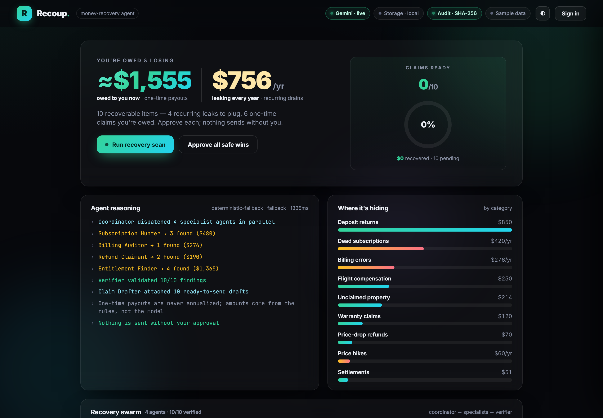
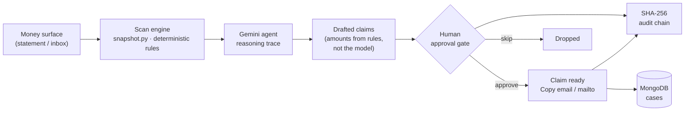
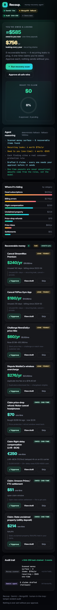

# Recoup — the AI that gets your money back

[](https://recoup-vaibhav4046s-projects.vercel.app)
[](LICENSE)


**Recoup** scans your financial footprint, has **Gemini** find money you're *losing*
(dead subscriptions, silent price hikes, billing errors) and money you're *owed*
(price-drop refunds, EU261 flight-delay compensation, class-action settlements,
unclaimed property), **drafts every claim**, and lets you **approve each one with a
single tap** — nothing is ever sent without you. Every step writes a tamper-evident
**SHA-256 audit chain**.

### ▶ Live demo: https://recoup-vaibhav4046s-projects.vercel.app



---

## Why this exists

Americans leave **billions** unclaimed every year — over **$1B in expiring tax
refunds**, a **$1.5B** Amazon Prime/FTC consumer fund, mountains of state unclaimed
property, plus the quiet drains of forgotten subscriptions and silent price creep.
The #1 reason people don't use AI for money is **trust**. Recoup's answer is a
**human-in-the-loop approval gate**: the agent does the finding and drafting; *you*
decide what actually gets sent.

## What it does (the flow)



1. **Scan** — `snapshot.py` runs a deterministic rule pass over the money surface and
   tags each finding by **cadence**: `yearly` (a recurring leak, shown as `$/yr`) or
   `once` (a one-time payout, never annualized).
2. **Reason** — Gemini writes the human-readable **reasoning trace**. It explains the
   findings; it never invents the numbers (amounts come from the rules).
3. **Draft** — each finding becomes a ready-to-send claim (cancellation email, dispute
   letter, EU261 claim, settlement filing…), each citing the consumer-protection rule.
4. **Approve** — the **only** path that readies a claim. One tap → status `claim_ready`,
   with **Copy email** and **Open in email** actions. Approving drafts a claim; it never
   asserts the money is already in hand.
5. **Audit** — every scan, draft, and approval folds into a **SHA-256 hash chain**
   (`audit.py`) with a `verify()` re-walk that detects any tampering.

## Design principles (why it's trustworthy)

- **Amounts are deterministic.** The model writes prose, not numbers — no hallucinated payouts.
- **One-time money is never annualized.** A €250 flight refund is shown as `€250`, never `€250/yr`.
  Totals are split: *recurring $/yr* vs *one-time owed now*.
- **Nothing sends without you.** The approval gate is enforced server-side in `state.py`.
- **Honest about state.** "Ready to claim" ≠ "recovered." Live vs. fallback is labelled everywhere.
- **Tamper-evident.** Real SHA-256 in both the backend and the in-browser demo chain.

## Architecture

```
recoup/
├─ index.html · styles.css · app.js · data.js   # zero-build static frontend (instant load)
├─ vercel.json                                   # static deploy config
└─ backend/                                      # FastAPI service (Docker / HF Spaces ready)
   ├─ app/
   │  ├─ snapshot.py   # money-surface + deterministic recovery rules (cadence-tagged)
   │  ├─ agent.py      # Gemini reasoning trace + claim drafting (+ 429/503 retry)
   │  ├─ state.py      # orchestration + human approval gate + split totals
   │  ├─ audit.py      # SHA-256 hash-chain audit log + verify()
   │  ├─ mongodb.py    # partner store (free Atlas M0); MCP-exposed collections
   │  ├─ config.py     # settings + honest integration status
   │  └─ main.py       # FastAPI endpoints + trace middleware
   ├─ Dockerfile       # python:3.12-slim, uvicorn on $PORT (7860 for HF)
   └─ requirements.txt
```

The frontend runs fully standalone on embedded demo data (`data.js`, generated from a
real backend run — including a real SHA-256 audit chain). Point `RO_CONFIG.apiBase` at a
deployed backend to overlay live Gemini reasoning and persisted MongoDB cases.

## API

| Method | Path | Purpose |
|---|---|---|
| `GET`  | `/api/health` | service + integration status |
| `POST` | `/api/scan` | scan the money surface |
| `POST` | `/api/agent/run` | Gemini drafts the plan + reasoning trace |
| `POST` | `/api/actions/{id}/approve` | the human approval gate (readies a claim) |
| `POST` | `/api/actions/{id}/reject` | skip a claim |
| `GET`  | `/api/audit` | the SHA-256 audit log + integrity |
| `POST` | `/api/report` | full recovery report |
| `GET`  | `/api/state` | hydration snapshot for the frontend |

## Free, no-card stack

| Layer | Tech | Cost |
|---|---|---|
| Reasoning | **Gemini 2.5-flash** (Google AI Studio) | free tier |
| Store / partner MCP | **MongoDB Atlas M0** + MongoDB MCP | free |
| Backend host | Hugging Face **Docker Spaces** | free |
| Frontend host | **Vercel** (static) | free |
| Data integrity | SHA-256 hash chain | — |

## Screens

| Command center | Mobile |
|---|---|
|  |  |

## Run locally

```bash
# backend
cd backend
pip install -r requirements.txt
cp .env.example .env          # add a free GOOGLE_API_KEY (optional; falls back if absent)
uvicorn app.main:app --reload --port 8099

# frontend (any static server)
cd ..
python -m http.server 8123    # open http://localhost:8123
```

## Roadmap

- **Live Gmail intake** — read receipt/subscription emails to populate the money surface from a real inbox.
- **MongoDB MCP** — agent reads/writes cases through the partner MCP server.
- **More recovery rules** — warranty claims, medical-bill errors, deposit returns, FX/foreign-transaction refunds.
- **Specialised sub-agents** — a coordinator dispatching hunter/auditor/claimant agents per category.

## License

MIT © 2026 Vaibhav Lalwani
