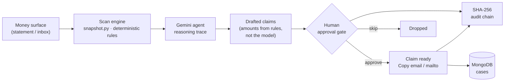
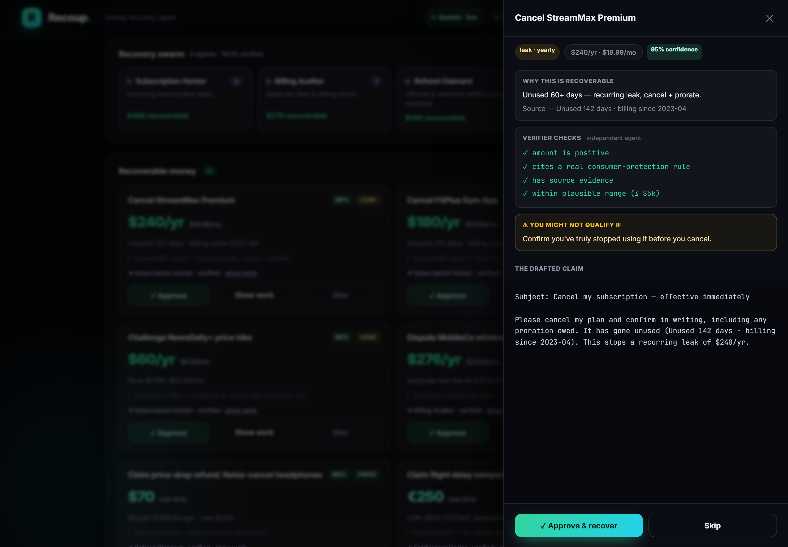
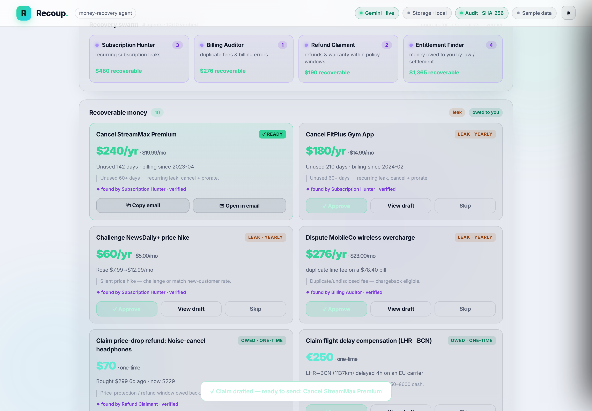

# Recoup — the AI that gets your money back

[](https://recoup-vaibhav4046s-projects.vercel.app)
[](LICENSE)


**Recoup** scans your financial footprint, has **Gemini** find money you're *losing*
(dead subscriptions, silent price hikes, billing errors) and money you're *owed*
(price-drop refunds, EU261 flight-delay compensation, class-action settlements,
unclaimed property), **drafts every claim**, and lets you **approve each one with a
single tap** — nothing is ever sent without you. Every step writes a tamper-evident
**SHA-256 audit chain**. The backend also ships an MCP-compatible JSON-RPC surface
(`mcp.py`) so agents can inspect Recoup state, run demo scans, and detect subscription
signals from Gmail message metadata without exposing OAuth tokens.

### ▶ Live demo: https://recoup-vaibhav4046s-projects.vercel.app

> **Live status (honest):** the frontend (Vercel) and the FastAPI backend currently running
> on Hugging Face are **live**: `/api/health`, `/api/state`, `/api/agent/recover`, Gemini,
> MongoDB Atlas Vector Search, and `/mcp` all respond. A Google Cloud Run image and exact
> deploy command are committed for the hackathon submission path.


---

## Why this exists

Americans leave **billions** unclaimed every year — over **$1B in expiring tax
refunds**, a **$1.5B** Amazon Prime/FTC consumer fund, mountains of state unclaimed
property, plus the quiet drains of forgotten subscriptions and silent price creep.
The #1 reason people don't use AI for money is **trust**. Recoup's answer is a
**human-in-the-loop approval gate**: the agent does the finding and drafting; *you*
decide what actually gets sent.

## What it does (the flow)



1. **Scan** — `snapshot.py` runs a deterministic rule pass over the money surface and
   tags each finding by **cadence**: `yearly` (a recurring leak, shown as `$/yr`) or
   `once` (a one-time payout, never annualized).
2. **Reason** — Gemini writes the human-readable **reasoning trace**. It explains the
   findings; it never invents the numbers (amounts come from the rules).
3. **Draft** — each finding becomes a ready-to-send claim (cancellation email, dispute
   letter, EU261 claim, settlement filing…), each citing the consumer-protection rule.
4. **Approve → Send → Recover** — approval is the **only** path that readies a claim, and
   each claim then advances **Drafted → Sent → Recovered**. Every card carries a **Copy**
   button, a deep-link to the *real* claim form (MissingMoney/NAUPA, the CAA for EU261, the
   FTC for settlements), a per-claim **confidence score**, and an honest **"why you might
   not qualify"** caveat. A one-tap **"show your work"** drawer renders the rule, the source
   evidence, and the Verifier agent's boolean checks. *"Recovered"* only counts money the
   user marks as actually received — never an overstated total.
5. **Audit** — every scan, draft, approval, send, and recovery folds into a **SHA-256 hash
   chain** (`audit.py`) with a `verify()` re-walk that detects any tampering.

## Design principles (why it's trustworthy)

- **Amounts are deterministic.** The model writes prose, not numbers — no hallucinated payouts.
- **One-time money is never annualized.** A €250 flight refund is shown as `€250`, never `€250/yr`.
  Totals are split: *recurring $/yr* vs *one-time owed now*.
- **Nothing sends without you.** The approval gate is enforced server-side in `state.py`.
- **Honest about state.** "Ready to claim" ≠ "recovered." Live vs. fallback is labelled everywhere.
- **Tamper-evident.** Real SHA-256 in both the backend and the in-browser chain (proves ordering + integrity).
- **Your data never leaves your device.** The **"Scan your statement"** path runs the entire rule engine *100% in your browser* (`recover.js`) — no upload, no account, no server. It detects your real recurring subscriptions, silent price hikes, and duplicate charges, then surfaces them in the same audited approve→recover flow.

## Architecture

```
recoup/
├─ index.html · styles.css · app.js · data.js   # zero-build static frontend (instant load)
├─ vercel.json                                   # static deploy config
└─ backend/                                      # FastAPI service (Docker / HF Spaces ready)
   ├─ app/
   │  ├─ snapshot.py   # money-surface + deterministic recovery rules (cadence-tagged)
   │  ├─ agent.py      # Gemini reasoning trace + claim drafting (+ 429/503 retry)
   │  ├─ state.py      # orchestration + human approval gate + split totals
   │  ├─ audit.py      # SHA-256 hash-chain audit log + verify()
   │  ├─ mongodb.py    # partner store (free Atlas M0) for approved cases
   │  ├─ mcp.py        # MCP-compatible JSON-RPC tools for agents + Gmail detector
   │  ├─ config.py     # settings + honest integration status
   │  └─ main.py       # FastAPI endpoints + trace middleware
   ├─ Dockerfile       # python:3.12-slim, uvicorn on $PORT (7860 for HF)
   └─ requirements.txt
```

The frontend runs fully standalone on embedded demo data (`data.js`, generated from a
real backend run — including a real SHA-256 audit chain). Point `RO_CONFIG.apiBase` at a
deployed backend to overlay live Gemini reasoning and persisted MongoDB cases.

## API

| Method | Path | Purpose |
|---|---|---|
| `GET`  | `/api/health` | service + integration status |
| `POST` | `/api/scan` | scan the money surface |
| `POST` | `/api/agent/run` | Gemini drafts the plan + reasoning trace |
| `POST` | `/api/actions/{id}/approve` | the human approval gate (readies a claim) |
| `POST` | `/api/actions/{id}/reject` | skip a claim |
| `GET`  | `/api/audit` | the SHA-256 audit log + integrity |
| `POST` | `/api/report` | full recovery report |
| `GET`  | `/api/state` | hydration snapshot for the frontend |
| `GET`  | `/mcp`, `/api/mcp` | MCP tool discovery metadata |
| `POST` | `/mcp`, `/api/mcp` | MCP-compatible JSON-RPC tool calls |

## Agent spine — Google Cloud Rapid Agent Hackathon (MongoDB track)

A qualifying, **additive** agent layer (existing product behavior unchanged):

```
Frontend → Cloud Run [ Gemini + Google ADK ] → MongoDB MCP (official) → Atlas Vector Search (memory)
```

- **Google ADK + Gemini** (`app/adk_agent.py`): an ADK `LlmAgent` with Gemini as the reasoner runs a **plan → tool → act → human-gate** loop. Runtime AI is **Google-only** (no non-Google AI deps).
- **Official MongoDB MCP toolset**: the agent queries Atlas through the official `mongodb-mcp-server` registered as an ADK `MCPToolset` (stdio / `npx`) — not hand-rolled DB calls.
- **Atlas Vector Search as memory**: recovery **playbooks** + consumer-protection **precedents** are embedded with Google `gemini-embedding-001` (768-d) and retrieved with Atlas `$vectorSearch` (cosine fallback while an index builds).
- **Deterministic + human gate**: every dollar amount is computed in code (never invented); every action stops at `pending_approval`.

| Method | Path | Purpose |
|---|---|---|
| `POST` | `/api/agent/plan` | ADK Gemini agent plans a recovery for one charge → `pending_approval` |
| `POST` | `/api/agent/recover` | end-to-end: charge → Atlas `$vectorSearch` playbook → ADK draft → `pending_approval` |
| `POST` | `/api/vector/seed` | embed precedents + playbooks; ensure the Atlas vector indexes |

Local smoke: `python backend/scripts/adk_smoke.py` (ADK agent) · `python backend/scripts/adk_mcp_smoke.py` (MongoDB MCP tool call — needs `MONGODB_URI`).

### Deploy the agent to Google Cloud Run (free tier)

```bash
# from the repo root (the root Dockerfile installs Node for the MongoDB MCP server)
gcloud run deploy recoup-agent \
  --source . --region us-central1 --allow-unauthenticated --memory 1Gi \
  --set-env-vars "GOOGLE_API_KEY=$GOOGLE_API_KEY,MONGODB_URI=$MONGODB_URI,MONGODB_DB=recoup,GEMINI_MODEL=gemini-2.5-flash,GOOGLE_GENAI_USE_VERTEXAI=FALSE,CORS_ORIGINS=*"

# gcloud prints the live URL → verify:
curl "$URL/api/health"            # vector.precedents + vector.playbooks populated
curl -X POST "$URL/api/agent/recover" -H 'content-type: application/json' \
     -d '{"charge":{"merchant":"StreamMax Premium","kind":"dead_subscription","amount":240}}'
```

Secrets come from environment variables — never hardcoded.

## Free, no-card stack

| Layer | Tech | Cost |
|---|---|---|
| Reasoning | **Gemini 2.5-flash** (Google AI Studio) | free tier |
| Store / partner MCP | **MongoDB Atlas M0** + MongoDB MCP | free |
| Agent tool surface | Google ADK + official MongoDB MCP server; HTTP MCP compatibility route | free |
| Backend host | Hugging Face **Docker Spaces** today; Cloud Run-ready image committed | free tier |
| Frontend host | **Vercel** (static) | free |
| Data integrity | SHA-256 hash chain | — |

## Screens

| Command center (4-agent swarm) | "Show your work" provenance |
|---|---|
|  |  |

| Mobile | Light mode |
|---|---|
|  |  |

## Run locally

```bash
# backend
cd backend
pip install -r requirements.txt
cp .env.example .env          # add a free GOOGLE_API_KEY (optional; falls back if absent)
uvicorn app.main:app --reload --port 8099
python scripts/mcp_smoke.py       # optional: validates MCP initialize/list/call

# frontend (any static server)
cd ..
python -m http.server 8123    # open http://localhost:8123
```

## Roadmap

- **More recovery rules** — warranty claims, medical-bill errors, deposit returns, FX/foreign-transaction refunds.
- **One-click filing** — pre-fill the official portals where their forms allow, instead of only deep-linking.
- **Confirmation-backed recoveries** — attach a receipt/reference to each recovery-log entry so it's evidenced, not self-reported.
- **Google OAuth verification** — move Gmail connect from test mode to verified production access.

## License

MIT © 2026 Vaibhav Lalwani
